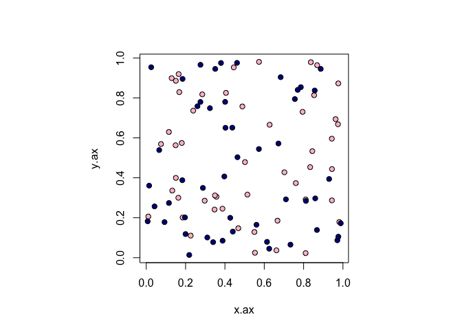
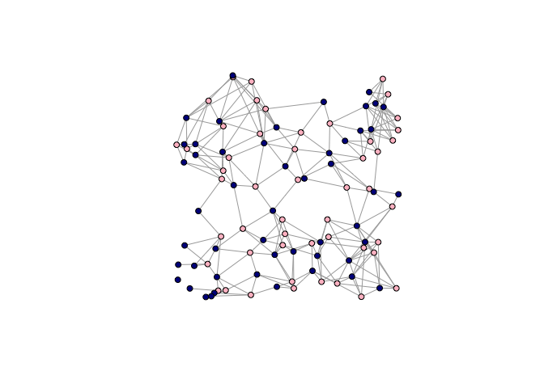
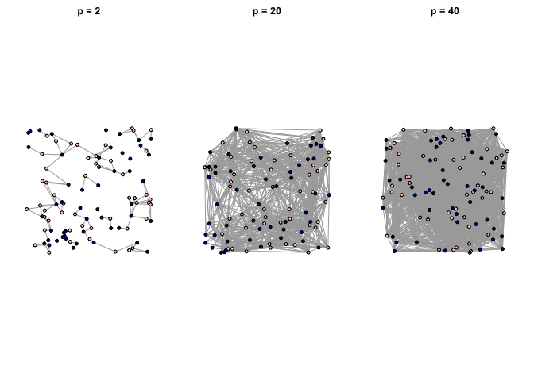
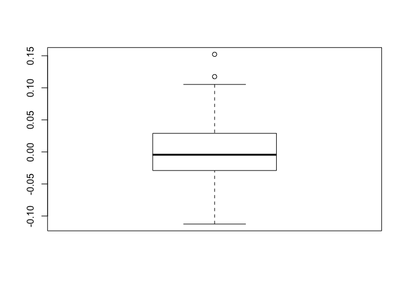
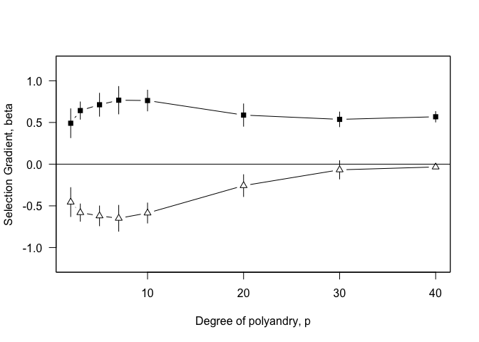

Sexual Networks: Sperm competition in polyandrous populations
================
Dai Shizuka
August 30, 2016

Sexual selection acts on traits that cause variation in fertilization success. In other words, sexual selection causes covariation between a "sexual" trait and fitness. A central idea behind sexual seleciton is that variation in fitness comes from a social process--i.e., through competition within sexes (often males) and mate choice (often by females). In turn, this means that the *social context*, e.g., the pattern of interactions between individuals (within AND between sexes) may influence the strength, direction and target of sexual selection. For example, whether a male with a given sexual trait value successfully sires offsrping may depend on the trait values of the other males that are competing for the same female.

McDonald et al. (2013) proposed a network-based approach to quantifying the strength of sexual selection based on an extension of existing framework for partitioning the effects of individual trait and group composition on fitness. This is sometimes called "multilevel-selection analysis". This involves an extension of the Lande-Arnold selection analysis to include the phenotype of the individual as well as the average phenotype of the group. To do this, we modify the classic regression technique for selection analysis to a multiple regression model:

\[\omega_{ij}=\beta_{1}z_{ij}+\beta_{2}Z_{j}+\epsilon\]

where \(\beta_{1}\) represents *the effect of an individual's trait on fitness given the trait values of his competitors* and \(|beta_{2}\) represents the *effect of the group composition on the individuals' fitness given his trait value*.

load required packages

``` r
library(igraph)
```

First, we can set up and visualize a population of 50 males and 50 females.

``` r
#generate dataframe with indiv ID, sex, x- and y-coordinates. x-coordinate also acts as male trait, z. 

sex=c(rep(1,50), rep(2,50)) #set sex of individuals: 1 for female, 2 for male
ids=c(paste("f",1:50,sep=""), paste("m",1:50,sep="")) # this will be the names of nodes
set.seed(2)
x.ax=runif(100, min=0, max=1) # x-axis coordinates
y.ax=runif(100, min=0, max=1) # y-axis coordinates

par(pty="s") #make the plotting region square
plot(x.ax,y.ax, pch=21,col="black", bg=c("pink", "darkblue")[sex])
```



Next, we will generate a Eucledian distance matrix between every pair of nodes

``` r
#calculate distance matrix
distances=as.matrix(dist(matrix(c(x.ax,y.ax), ncol=2), method="euclidean",diag=T, upper=T))
distances[1:5,1:5] #display the top left corner
```

    ##           1         2         3         4         5
    ## 1 0.0000000 0.5649713 0.8710722 0.6282129 0.7638184
    ## 2 0.5649713 0.0000000 0.5678196 0.6682277 0.2794498
    ## 3 0.8710722 0.5678196 0.0000000 0.4327280 0.7863823
    ## 4 0.6282129 0.6682277 0.4327280 0.0000000 0.9463372
    ## 5 0.7638184 0.2794498 0.7863823 0.9463372 0.0000000

We can use this to create an incidence matrix for our bipartite network with females connected to *p* closest males.
For simplicity, I have turned this into a function called `make_sexnet_random()`, which takes three arguments: number of females, number of males, and the degree of polyandry (*p*).

``` r
make_sexnet_random=function(n.female, n.male, p){
    x.f=runif(n.female, min=0, max=1)
    y.f=runif(n.female, min=0, max=1)
    x.m=runif(n.male, min=0, max=1)
    y.m=runif(n.male, min=0, max=1)
    distances=as.matrix(dist(matrix(c(c(x.f, x.m), c(y.f, y.m)), ncol=2 ), method="euclidean", diag=T, upper=T))
    mat=matrix(0,nrow=n.female, ncol=n.male)
for(i in 1:n.male){
  males=order(distances[i,(n.female+1):(n.male+n.female)])[1:p]
  mat[i,males]=1
}

g=graph_from_incidence_matrix(mat)
g$layout=matrix(c(c(x.f, x.m),c(y.f, y.m)), ncol=2)
V(g)$sex=c("F", "M")[V(g)$type+1]
V(g)$id=paste(V(g)$sex, c(rep(1:n.female), rep(1:n.male)), sep="")
return(g)
}
```

We can now use this function to create a sexual network, ala McDonald et al. (2013)

``` r
g=make_sexnet_random(50,50, p=5)
plot(g, layout=g$layout, vertex.label="", vertex.color=c("pink", "darkblue")[V(g)$type+1], vertex.size=5)
```



With this function, it's easier to generate a bunch of graphs of different sizes or levels of polyandry

``` r
p=c(2,20,40)
par(mfrow=c(1,3), mar=c(2,2,2,2))
set.seed(2)
for(i in 1:3){
    g=make_sexnet_random(50,50, p=p[i])
    plot(g, layout=g$layout, vertex.label="", vertex.color=c("pink", "darkblue")[V(g)$type+1], vertex.size=5, main=paste("p = ", p[i], sep=""))
}
```



**Contextual Analysis**
Now, we will begin the work of calculating the fitness of each male *i* for the contextual analysis.
Since we are talking about post-copulatory sexual selection (sperm competition), we can consider the fraction of a female's ova that male *i* fertilizes. We will set this to be proportional to the male's trait value \(z_{i}\), relative to the trait value of all other males that mated with that female. Explicitly, the proportion of the *j*th female's ova fertilized by the *i*th male is:

\[W_{ij}=\frac{z_{i}}{\sum_{t=1}^{n}z_{it}^{j}+z_i}\]

We then take the ***post-copulatory*** reproductive success of male *i*, \(W_{i}\), is the average \(W_{ij}\) over all females *j* with whom he mated.

\[W_{i}=\frac{\sum{W_{ij}}}{n_{ij}}\]

I'll first write out the script for calculating \(W_{i}\), but I will later create a function that calculates both this and \(Z_{j}\)

Note that in the McDonald et al. (2013) example, the male's trait value is simply its x-axis coordinate.

``` r
# calculate Wij only
set.seed(2)
g=make_sexnet_random(50,50,p=5)
n.male=length(which(V(g)$sex=="M"))
W=vector(length=n.male)
mat=as_incidence_matrix(g)
z=g$layout[,1][which(V(g)$sex=="M")]

for (i in 1:n.male){
    j=which(mat[,i]>0) #females that male i mated with
    if (length(j)==0) W[i]=NA  #skip the male if he did not mate with a female ##this is valid only because they are looking at sperm comeptition (not pre-copulatory sexual selection)
    else {
        if (class(mat[j,])=="numeric") {
            zit_j=sum(z[-i]*mat[j,-i]) #the sum of trait values for all competitors of i for female j
            }
        else{
        zit_j=apply(mat[j,-i],1, function(x) sum(z[-i]*x)) #sum of traits of all males that mated with female mate j of male i (including male i)
        }
        wij=z[i]/(zit_j+z[i])
        W[i]=mean(wij)
    }}
head(W)
```

    ## [1] 0.1925645 0.2446041 0.2257218 0.1931666 0.2445389 0.1972488

If calculated correctly, \(\overline{W}\) should roughly equal \(\frac{1}{p}\)

``` r
1/g$p # g$p is polyandry level for the network
```

    ## numeric(0)

``` r
mean(W) 
```

    ## [1] 0.1965823

Now, calculate Zi(local-unweighted) only

``` r
#calculate Zi.local only
#remember, in Contextual analysis the group INCLUDES the focal individual
set.seed(2)
g=make_sexnet_random(50,50,p=5)
n.male=length(which(V(g)$sex=="M"))
zi.local=vector(length=n.male)
for (i in 1:n.male){
    j=which(mat[,i]>0) #females that male i mated with
        if (class(mat[j,])=="numeric") {
            zi.local[i]=(sum(z*mat[j,])+z[i])/(sum(mat[j,])+1)
            }
        else{
        zi.local[i]=(sum(z*colSums(mat[j,]))+z[i])/(sum(mat[j,])+1)
        }}
head(zi.local)
```

    ## [1] 0.2113894 0.3611028 0.8753699 0.8579386 0.2989763 0.6098129

If calculated correctly, the difference between zi and zi(local-unweighted) should be distributed around 0 (I think).

``` r
boxplot(z-zi.local)
```



Make this into a function that calculates both W and zi.local from a sexnet object.

``` r
## Function for calculating W and Zi.local (unweighted) together, given a sexnet.
extract_params=function(sexnet, trait){
    n.male=length(which(V(sexnet)$sex=="M"))
    mat=as_incidence_matrix(sexnet)
    W=vector(length=n.male)
    zi.local=vector(length=n.male)
    z=trait
    for (i in 1:n.male){j=which(mat[,i]>0) 
    if (length(j)==0) {
        W[i]=NA
        zi.local[i]=NA
        }
    else {
        if (class(mat[j,])=="numeric") {
            zit_j.zi=sum(z*mat[j,]) 
            zi.local[i]=(sum(z*mat[j,])+z[i])/(sum(mat[j,])+1)
            }
        else{
        zit_j.zi=apply(mat[j,],1, function(x) sum(z*x)) 
        zi.local[i]=(sum(z*colSums(mat[j,]))+z[i])/(sum(mat[j,])+1)
        }
        wij=z[i]/(zit_j.zi+z[i])
        W[i]=mean(wij)
    }}
    return(list(W=W, z=z, zi.local=zi.local))
}
    
params=extract_params(g, trait=g$layout[,1][which(V(g)$sex=="M")])
str(params)
```

    ## List of 3
    ##  $ W       : num [1:50] 0.161 0.196 0.184 0.162 0.189 ...
    ##  $ z       : num [1:50] 0.201 0.428 0.981 0.829 0.287 ...
    ##  $ zi.local: num [1:50] 0.211 0.361 0.875 0.858 0.299 ...

Now, we can do the selection gradient analysis as a multiple linear regression. Remember to first divide W by the population mean, and center+scale the z and zi.local parameters.

``` r
norm.W=W/mean(W, na.rm=T)
scale.z=scale(z)
scale.zi.local=scale(zi.local)
mod=lm(norm.W~scale.z+scale.zi.local)
mod$coef
```

    ##    (Intercept)        scale.z scale.zi.local 
    ##      1.0000000      0.8180474     -0.7284708

Make this into a function

``` r
get_coefs=function(params){
    norm.W=params$W/mean(params$W, na.rm=T)
    scale.z=scale(params$z)
    scale.zi.local=scale(params$zi.local)
    coefs=lm(norm.W~scale.z+scale.zi.local)$coef
    return(coefs)
}
coefs=get_coefs(params)
coefs
```

    ##    (Intercept)        scale.z scale.zi.local 
    ##      1.0000000      0.7228488     -0.6346752

With these functions, we can now run the analysis in a few easy steps:

``` r
g=make_sexnet_random(n.female=50,n.male=50, p=5)
params=extract_params(g, trait=g$layout[,1][which(V(g)$sex=="M")])
coefs=get_coefs(params)
coefs
```

    ##    (Intercept)        scale.z scale.zi.local 
    ##      0.9740857      0.9079560     -0.7758861

Now, we can loop this whole thing to conduct a bunch of iterations over a range of levels of polyandry. (Code shown but not run)

``` r
#Run the whole thing over a range of polyandry levels
p=c(2, 3, 5, 7, 10, 20, 30, 40) #degree of polyandry
reps=100
n.female=50
n.male=50

coef.list=list()
for(a in 1:length(p)){
    coefs=matrix(nrow=reps, ncol=3, dimnames=list(c(paste("it.",1:reps,sep="")), c("intercept", "beta1", "beta2")))
    for (b in 1:reps){
        g=make_sexnet_random(n.female,n.male, p=p[a])
        params=extract_params(g, trait=g$layout[,1][which(V(g)$sex=="M")])
        coefs[b,]=get_coefs(params)
    }
    coef.list[[a]]=coefs
}
names(coef.list)=paste("p=",p,sep="")

coef.list

mean.beta1=unlist(lapply(coef.list, function(x) colMeans(x)[2]))
mean.beta2=unlist(lapply(coef.list, function(x) colMeans(x)[3]))
sd.beta1=unlist(lapply(coef.list, function(x) sd(x[,2])))
sd.beta2=unlist(lapply(coef.list, function(x) sd(x[,3])))

plot(p, mean.beta1, type="b", ylim=c(-1.2,1.2), pch=15, xaxt="n", yaxt="n", xlab="", ylab="", panel.first=for(i in 1:length(p)){
lines(c(p[i], p[i]), c(mean.beta1[i]+sd.beta1[i], mean.beta1[i]-sd.beta1[i]))
})
par(new=T)
plot(p, mean.beta2, type="b", ylim=c(-1.2,1.2), pch=24, bg="white",  las=1, ylab="Selection Gradient, beta", xlab="Degree of polyandry, p", panel.first=for(i in 1:length(p)){
  lines(c(p[i], p[i]), c(mean.beta2[i]+sd.beta2[i], mean.beta2[i]-sd.beta2[i]))})

abline(h=0)
```

Here's an updated version of the functions with the option for running the 'neighborhood' model, which is perhaps more correct for social selection analysis

``` r
### add neighbor analysis option
extract_params=function(sexnet, trait, method="contextual"){
    n.male=length(which(V(sexnet)$sex=="M"))
    mat=as_incidence_matrix(sexnet)
    W=vector(length=n.male)
    zi.local=vector(length=n.male)
    z=trait
    for (i in 1:n.male){j=which(mat[,i]>0) 
    if (length(j)==0) {
        W[i]=NA
        zi.local[i]=NA
        }
    else {
        if (class(mat[j,])=="numeric") {
            zit_j.zi=sum(z*mat[j,]) 
            if (method=="contextual") zi.local[i]=(sum(z*mat[j,])+z[i])/(sum(mat[j,])+1)
            else if (method=="neighborhood")zi.local[i]=(sum(z[-i]*mat[j,-i])+z[i])/(sum(mat[j,-i])+1)
            else return("error: supply valid method")
            }
        else{
        zit_j.zi=apply(mat[j,],1, function(x) sum(z*x)) 
        if (method=="contextual") zi.local[i]=(sum(z*colSums(mat[j,]))+z[i])/(sum(mat[j,])+1)
        else if (method=="neighborhood") zi.local[i]=(sum(z[-i]*colSums(mat[j,-i]))+z[i])/(sum(mat[j,-i])+1)
        else return("error: supply valid method")
        }
        wij=z[i]/(zit_j.zi+z[i])
        W[i]=mean(wij)
    }}
    return(list(W=W, z=z, zi.local=zi.local))
}
    
params.context=extract_params(g, trait=g$layout[,1][which(V(g)$sex=="M")], method="contextual")
params.neighborhood=extract_params(g, trait=g$layout[,1][which(V(g)$sex=="M")], method="neighborhood")
```

Now you can extract the parameters for contextual or neighborhood analysis using the same function

``` r
params.context=extract_params(g, trait=g$layout[,1][which(V(g)$sex=="M")],method="contextual")
params.neighborhood=extract_params(g, trait=g$layout[,1][which(V(g)$sex=="M")], method="neighborhood")
```

Now run the whole thing over a range of polyandry levels using neighborhood analysis

``` r
p=c(2, 3, 5, 7, 10, 20, 30, 40) #degree of polyandry
reps=20
n.female=50
n.male=50

coef.list=list()
for(a in 1:length(p)){
    coefs=matrix(nrow=reps, ncol=3, dimnames=list(c(paste("it.",1:reps,sep="")), c("intercept", "beta1", "beta2")))
    for (b in 1:reps){
        g=make_sexnet_random(n.female,n.male, p=p[a])
        params=extract_params(g, trait=g$layout[,1][which(V(g)$sex=="M")],method="neighborhood")
        coefs[b,]=get_coefs(params)
    }
    coef.list[[a]]=coefs
}
names(coef.list)=paste("p=",p,sep="")


mean.beta1=unlist(lapply(coef.list, function(x) colMeans(x)[2]))
mean.beta2=unlist(lapply(coef.list, function(x) colMeans(x)[3]))
sd.beta1=unlist(lapply(coef.list, function(x) sd(x[,2])))
sd.beta2=unlist(lapply(coef.list, function(x) sd(x[,3])))

plot(p, mean.beta1, type="b", ylim=c(-1.2,1.2), pch=15, xaxt="n", yaxt="n", xlab="", ylab="", panel.first=for(i in 1:length(p)){
lines(c(p[i], p[i]), c(mean.beta1[i]+sd.beta1[i], mean.beta1[i]-sd.beta1[i]))
})
par(new=T)
plot(p, mean.beta2, type="b", ylim=c(-1.2,1.2), pch=24, bg="white",  las=1, ylab="Selection Gradient, beta", xlab="Degree of polyandry, p", panel.first=for(i in 1:length(p)){
  lines(c(p[i], p[i]), c(mean.beta2[i]+sd.beta2[i], mean.beta2[i]-sd.beta2[i]))})

abline(h=0)
```



Last thing: In *Social Selection Analysis* (Wolf et al. 1999), you would calculate the net selection differential on the trait as: \[s_{i}=P_{ii}\beta_{1}+C_{ij}\beta_{2}\] where \(P_{ii}\) is the variance of the trait value and \(C_{ij}\) is the covariance between the individual trait and average group trait.

We can calculate that:

``` r
n.female=50
n.male=50
g=make_sexnet_random(n.female,n.male, p=40)
params=extract_params(g, trait=g$layout[,1][which(V(g)$sex=="M")],method="neighborhood")
coef=get_coefs(params)
Cij=cov(params$z, params$zi.local)
Pii=var(params$z)
s=as.numeric(Pii*coef[2]+Cij*coef[3])
s
```

    ## [1] 0.0437122

***Questions***
1. For contextual analysis, the only way I have been able to get the results of McDonald et al. (2013) is to have z[i] in the numerator and the denominator twice?

**REFERENCES**
McDonald, G. C., James, R., Krause, J., & Pizzari, T. (2013). Sexual networks: measuring sexual selection in structured, polyandrous populations. Philosophical Transactions of the Royal Society B-Biological Sciences, 368(1613), 20120356. <http://doi.org/10.1098/rstb.2012.0356>

Wolf, J. B., Brodie, E. D., III, & Moore, A. J. (1999). Interacting Phenotypes and the Evolutionary Process. II. Selection Resulting from Social Interactions. The American Naturalist, 153(3), 254–266. <http://doi.org/10.1086/303168>
